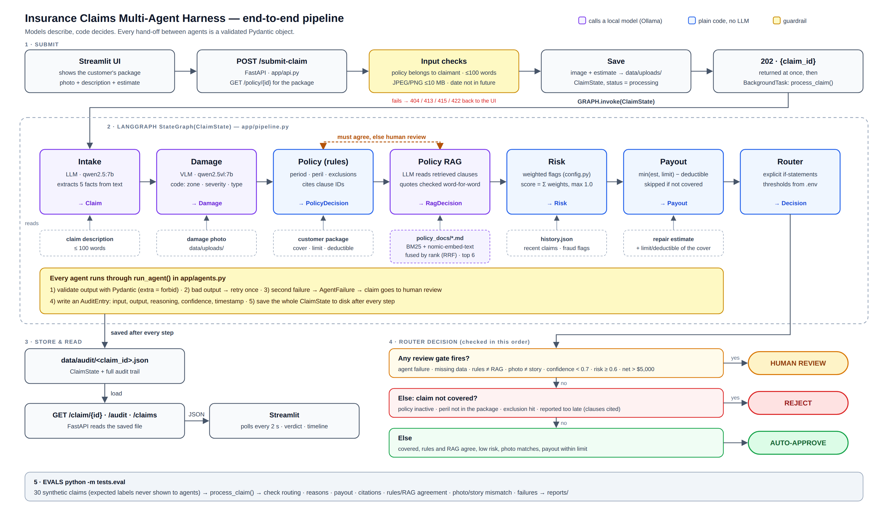

# Insurance Claims Multi-Agent Harness

Upload a car damage photo + a short description (≤100 words). Six agents check it against the
customer's insurance package and the company's policy wording, and a rule-based router decides
**Auto-Approve / Human Review / Reject**. Every step is saved in an audit trail.

Models run locally with Ollama. The idea: **models describe, code decides.**



## The 6 agents + router

| # | Step | Uses | What it does |
|---|---|---|---|
| 1 | Intake | LLM `qwen2.5:7b` | pulls 5 facts from the description (incident type, areas, severity, other party, circumstances) |
| 2 | Damage | VLM `qwen2.5vl:7b` + rules | model describes the photo; code checks it matches the story |
| 3 | Policy | rules | period, peril in the package, exclusions, reporting window; cites clause ids |
| 4 | Policy RAG | search + LLM | searches the policy wording (BM25 + embeddings), LLM decides from it with exact quotes; must agree with step 3 |
| 5 | Risk | rules | weighted flags: frequent claims, fraud flag, photo mismatch, late report, new policy... |
| 6 | Payout | maths | `min(estimate, limit) − deductible` |
| – | Router | if-statements | review if anything looks wrong → else reject if not covered → else approve |

## Safety rules

1. Agents pass Pydantic objects, never free text (`extra="forbid"`).
2. Every agent attempt is logged and saved to `data/audit/<claim_id>.json`.
3. Policy decisions cite real clause ids; RAG quotes must be word-for-word.
4. High risk, photo mismatch, low confidence, rules≠RAG or payout > $5,000 → human review.
5. The router is plain code, no LLM.
6. Bad model output → retry once → second failure → human review.

## Run it

Full Windows steps (models stored on F:, not C:): **[RUN_STEPS.md](RUN_STEPS.md)**. Short version:

```bash
ollama pull qwen2.5vl:7b && ollama pull qwen2.5:7b && ollama pull nomic-embed-text
pip install -r requirements.txt
copy .env.example .env
uvicorn app.api:app --reload        # API  → http://localhost:8000/docs
streamlit run app/ui.py             # UI   → http://localhost:8501
```

## Test

```bash
pytest                      # fast, fake models, no Ollama needed
python -m tests.eval        # 30 sample claims with the real models → pass rate in reports/
```

| Mode | Pass rate |
|---|---|
| Fake models (code logic) | 100% (30/30) |
| Real local models | run `python -m tests.eval` and fill in |
